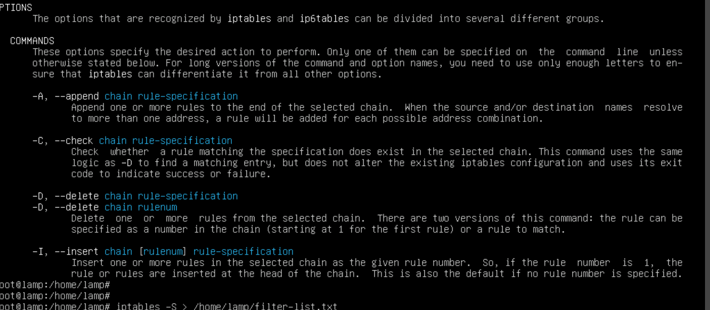

# Lab Write-Up: Threat Hunting and Indicators of Compromise

In this lab, I will perform threat hunting activities and track indicators of compromise (IoCs) within the internal network of **Structureality Inc.** As a cybersecurity analyst, my goal is to identify vulnerabilities, unusual activity, and potential threats that could compromise the organization’s systems.

The lab is structured to provide hands-on experience with multiple security tools and techniques. I will begin by analyzing **firewall logs** to detect questionable network traffic. Next, I will use **netstat** to identify IoCs related to traffic abuse targeting a secure website. Following that, I will perform focused threat-hunting exercises across several virtual machines to investigate suspicious behavior. Finally, I will analyze unusual **DNS activity** to uncover additional IoCs that may indicate malicious activity.

Throughout this lab, I will apply core **CompTIA CySA+ objectives**, including:

- Analyzing indicators of potentially malicious activity  
- Using appropriate tools to investigate threats  
- Comparing threat intelligence and threat-hunting concepts  
- Performing incident response activities  

This lab will reinforce my understanding of proactive threat detection and the methods used to secure an enterprise network environment.
