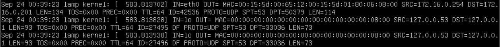
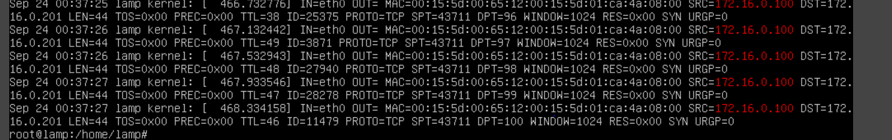
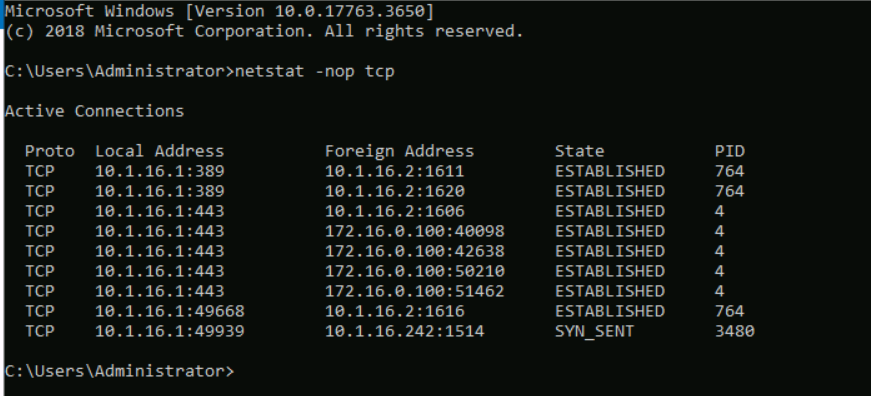
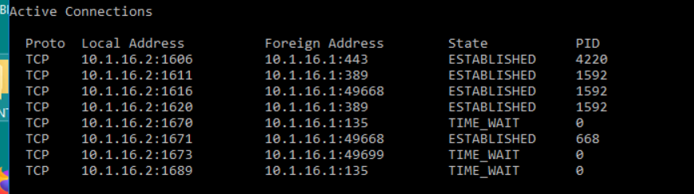
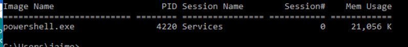
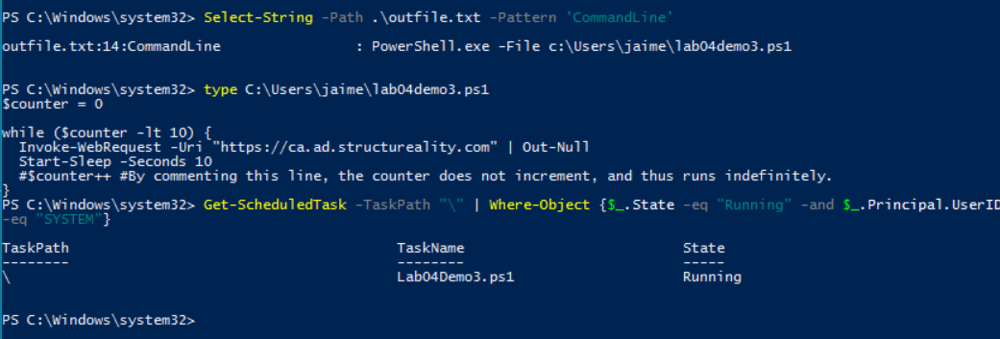
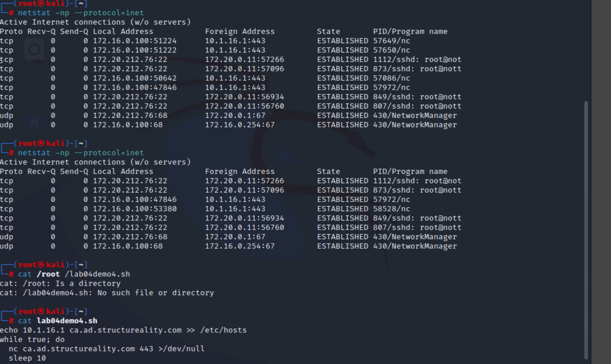

# Lab Write-Up: Threat Hunting and Indicators of Compromise

In this lab, I will perform threat hunting activities and track indicators of compromise (IoCs) within the internal network of **Structureality Inc.** As a cybersecurity analyst, my goal is to identify vulnerabilities, unusual activity, and potential threats that could compromise the organization’s systems.

The lab is structured to provide hands-on experience with multiple security tools and techniques. I will begin by analyzing **firewall logs** to detect questionable network traffic. Next, I will use **netstat** to identify IoCs related to traffic abuse targeting a secure website. Following that, I will perform focused threat-hunting exercises across several virtual machines to investigate suspicious behavior. Finally, I will analyze unusual **DNS activity** to uncover additional IoCs that may indicate malicious activity.

Throughout this lab, I will apply core **CompTIA CySA+ objectives**, including:

- Analyzing indicators of potentially malicious activity  
- Using appropriate tools to investigate threats  
- Comparing threat intelligence and threat-hunting concepts  
- Performing incident response activities  

This lab will reinforce my understanding of proactive threat detection and the methods used to secure an enterprise network environment.

# Lab Activity: Enabling Logging, Generating Traffic, and Inspecting Tools

## What I did
I connected to the **LAMP** VM and signed in as `lamp` (password `Pa$$w0rd`). I elevated to root privileges with:

```bash
sudo su
# enter Pa$$w0rd when prompted

# enter command for iptables    
iptables -A INPUT -j LOG
```

I exported the current iptables rules to a readable file (the lab verification script cannot read the rules directly)

```bash
iptables -S > /home/lamp/filter-list.txt

# shows the last 10 lines and follows new entries
```

tail -f /var/log/kern.log
I then started live monitoring of the kernel log so I could observe events as they occurred:

I left the tail -f running to capture log activity.

Next, I connected to KALI VM as root (Pa$$w0rd), and opened the terminal

```bash
vim ./lab04demo1.sh
```
I seen it was a .sh file meaning that it was a script so got curious and opened the file to read it

```bash
nmap 172.16.0.201 -p 1-100 -r -T2 >/dev/null
```
I seen that it was a nmap with some research in the man page i found out it was checking ports 1 through 100 -r for do not randomize order of ports scanned -T2 for the timing template then piping the result to /dev/null

Then I ran the script and waited for the terminal prompt to reappear

Entered to check the ip on eth0 interface
```bash
ip a s eth0
```

I see that the ip address for the kali machine is 172.16.0.100
Switching back to the LAMP machine with the tail command still going I see it is getting network traffic from the kali machines ip from the nmap script

I then used a command to grep out all the instances of that ip from the kernal logs
```bash
grep 172.16.0.100 /var/log/kern.log
```

The logs indicate that there was port scanning being done on different ports by sending syn packets

# Tracking down abnormal connections

## What I did
Signed into the DC10 windows server then I opend up the command prompt
Then I entered this command to start the investigation

```
netstat -nop tcp
```
The -n parameter displays numbers instead of hostnames and protocol acronymns

The -o parameter displays the associated PID or process id 

-p limits the display to the specified protcol which we specified to be tcp.



I see that ip addreses 10.1.16.2 and 172.16.0.100 is has a web connnection on multiple ports to the DC10 server

Then I would check the network configuration documentation to find out if those connections are normal

Then I think the PID  associated with web connections is PID for i can type in a specific command to find what that is 
```
tasklist /FI "PID eq 4"
```


Then I switched to the MS10 windows server opened up the command prompt and entered the same command
```
netstat -nop tcp
```

I searched for the pid using this pid
```
tasklist /FI "PID eq 4220"
```

I see that it is the process for powershell.exe
On my computer I naviage to the search bar and type in powershell
```
Get-WmiObject win32_process -filter 'processid=4220' > outfile.txt
```
Here we are piping the win32 process for the specific pid into an output file. 
```
type outfile.txt
```

We need the command line entry so we will use a command to get that out
```
Select-String -Path .\outfile.txt -Pattern 'CommandLine'
```
Once we get the output of the file location we will cat the script to see what it does then consult to see if its a legitamite script


We confirmed this activity is normal and will now switch to our kali machine

I will enter the linux netstat command to check for IOC's
```bash
netstat -np --protocol=inet
```
Then I ran the command again and see that the list returned was different but the program that was in both returns was nc which I know can be used for malicious activity



I then used cat on the script that caused the compromise
```bash
echo 10.1.16.1 ca.ad.structreality.com >> /etc/hosts
while true; do
    nc ca.ad.structureality.com 443 >/dev/null
    sleep 10
