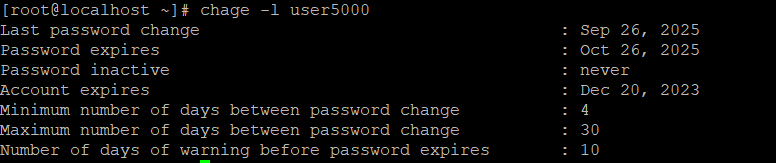
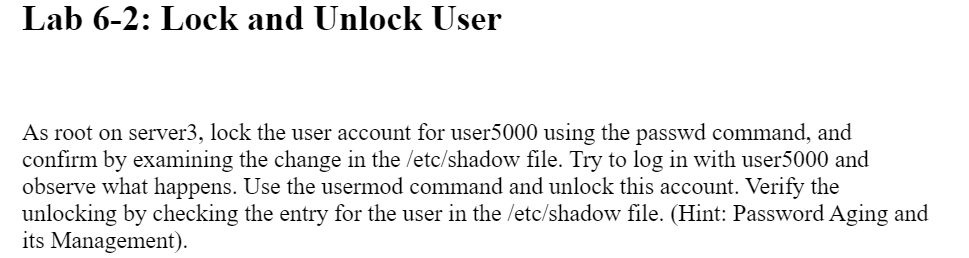
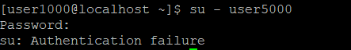
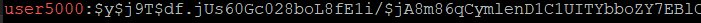
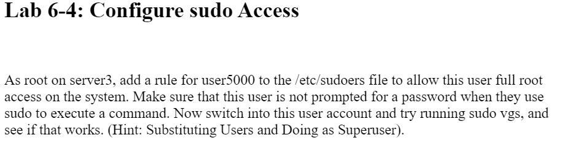
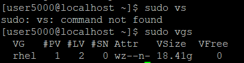

# Lab 6-1 Create User and Configure Password Aging  
You can use groupadd and man -h if you need to remember the flags
``` bash
groupadd -g 6000 lnxgrp
```
``` bash
useradd -g 6000 -u 5000 user5000
```
``` bash
passwd user5000
```
``` bash
chage -m 4 -M 30 -W 10 user5000
```
``` bash
chage -E 2023-12-20 user5000
```
``` bash
chage -l user5000
```


# Lab 6-2 Lock and Unlock user

``` bash
passwd -l user5000
```
``` bash
sudo cat /etc/shadow
```


The ! infront of the hash indicates the account is locked



The authentication failure is because the account was properly locked

``` bash
usermod -U user5000
```

``` bash
grep user5000 /etc/shadow
```



# Lab 6-3 Modify group
``` bash
groupmod -g 7000 lnxgrp
```
``` bash
usermod -aG lnxgrp user1000
usermod -aG lnxgrp user2000
```
``` bash
groupmod -n  dbagrp lnxgrp
```
``` bash
grep dbagrp /etc/group
```


# Lab 6-4 Configuring Sudo Acess

```bash 
visudo
```
Put this text in the visudo file

You can see after running the vgs command in sudo there is no password prompt

